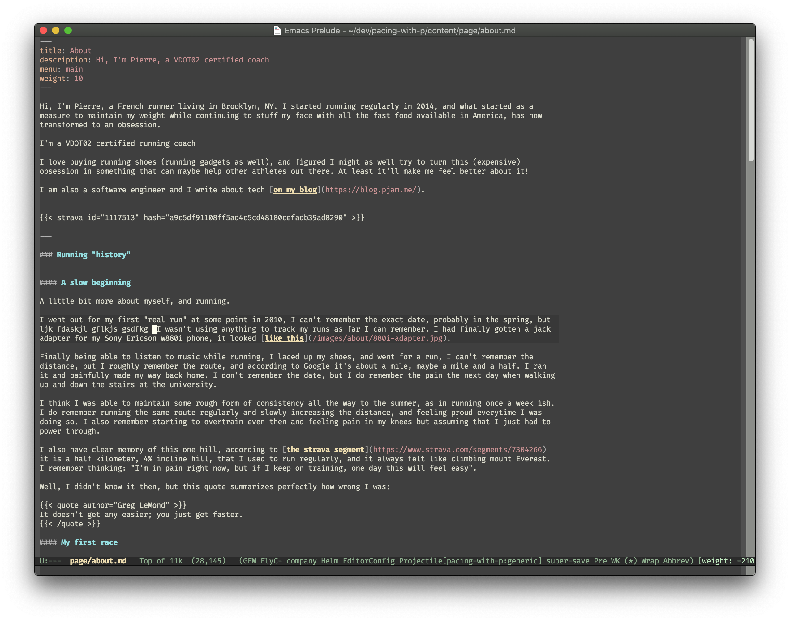
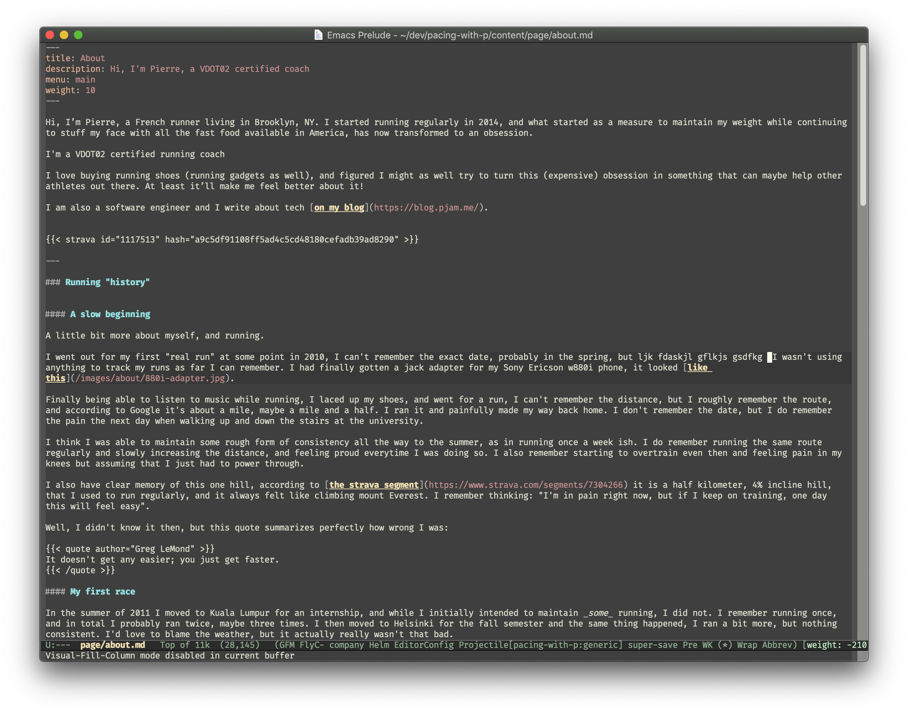
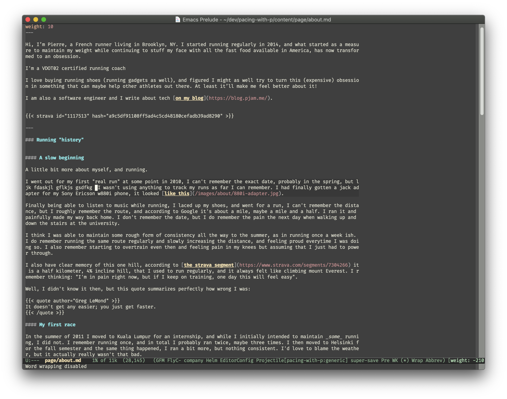

# Write texts as if it was formatted as paragraphs

I like using emacs to write, I also like having the text I write to look like
nicely formatted paragraphs, so that it looks like a nice column of text. By
default text editor won't really do that and extend to the available width and
either soft wrap or overflow.

I took the habit of formatting paragraphs with vim and emacs manually,
respecticvely with `gq` and `M-q`, but this approach has many issues, main two.
The first one being that it's not really portable, if you want to paste in
another editor, you're bringing in a column of texts with newline characters
and it might break whenyou do so. This happened to me when copying markdown
content to dev.to.
The second one being that it requires a lot of manual formatting, if you edit
anexisting paragraph, you have to reformat it manually.

I recently realized that the `visual-line-mode` in emacs was really close to
what I wanted, the text looks like it's formatted with newlines, you even get
shortcuts to go to the beginning of the line, as if it was a new line (and to
the end of the line) but each paragraph is just one line of text when it's
save. The only issue I had is that it takes the whole width available by
default. Not a huge problem, I can split my panes or resize my window, but not
what I wanted.

Enter,
[visual-fill-column](https://github.com/joostkremers/visual-fill-column), and
it does exactly what I want!

I now have the following lines in my emacs config file:

```elisp
(add-hook 'gfm-mode-hook #'visual-line-mode)
(add-hook 'visual-line-mode-hook #'visual-fill-column-mode)
```

The first one enables `visual-line-mode` when I am editing a markdown file, the
second one enables `visual-fill-column-mode` when I am in `visual-line-mode`.

Finally, make sure that `word-wrap` is set to `t` so that lines look nice!

And that's it!

### Screenshots:

#### With `visual-line` and `visual-fill-column` (`fill-column` at 120)




#### With `visual-line` and `wrod-wrap`, without `visual-fill-column` (`fill-column` at 120)




#### With `visual-line` and `visual-fill-column` but without `word-wrap` (`fill-column` at 120)


